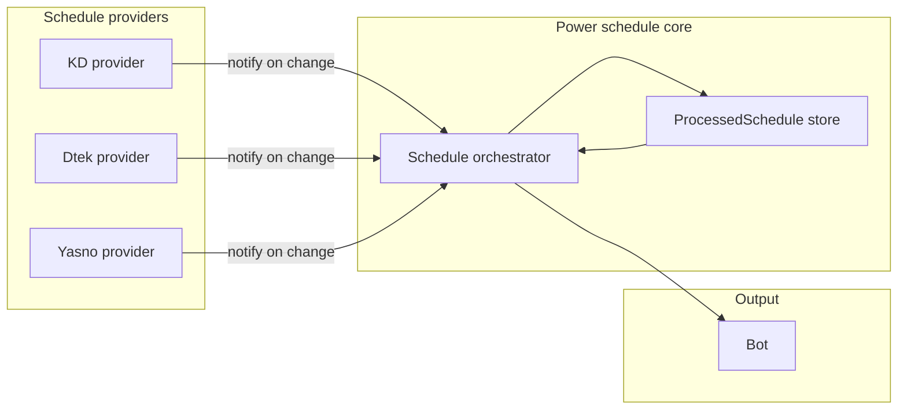

# Power schedule multi-provider refactor

## Current state

- **Single provider**: All logic lives in [kd.service.ts](../src/modules/kyiv-digital/services/kd.service.ts) (Kyiv Digital).
- **Two flows**:
  1. **Feed** (power announcements): Polls KD feed for items like "Стабілізаційне відключення", "Світло повертається", "Графік не діє". New items are sent to bot groups. Uses [KdProcessedFeedItem](../src/modules/kyiv-digital/schemas/kd-processed-feed-item.schema.ts) for dedup.
  2. **Schedule changes**: Polls KD `v4/dtek/{objectId}` for a week schedule; for **today** and **tomorrow** compares with [KdProcessedScheduleInfo](../src/modules/kyiv-digital/schemas/kd-processed-schedule-info.schema.ts) (by `dateIso`). If schedule changed or is new, builds a message (via `buildDayScheduleMessage`), sends to groups, and persists. Uses [IScheduleItem](../src/modules/kyiv-digital/interfaces/schedule-response.interface.ts) (e.g. `day_of_week`, `hours` with `h00_0`…`h23_1`, `PowerState`).
- **On-demand**: Bot commands "schedule today/tomorrow" and "send schedule to all" emit `PendingMessageType.GetSchedule` / `SendScheduleToAll`; KD subscribes and calls `sendScheduleToChat()` → `getWeekSchedule()` → `buildDayScheduleMessage()`.

So: schedule format (half-hour slots, On/Off/MaybeOff) and "processed per date" are already a good fit for multi-provider; they are just coupled to KD and KD-specific APIs.

## Goal

- **Three providers**: Kyiv Digital (KD), Dtek, Yasno — each can report schedule for the same address (today/tomorrow).
- **Single message per date**: Only the **most recent** schedule update (per date) is sent via the bot; no duplicate or conflicting messages when several providers update.
- **Same UX**: Same bot commands and message format (e.g. "Графік на …", time ranges).

## "Most recent" and flow (decided)

- **Push model**: Each provider service periodically requests its own API (like current `handleScheduleChanges`). When a provider **detects a new or changed schedule** for a date, it **notifies the orchestrator** (e.g. `orchestrator.onScheduleChange(providerId, date, normalizedSchedule, updatedAt?)`). The orchestrator does not poll providers.
- **No feeds for multi-provider**: All providers will have logic similar to schedule-change detection in [kd.service.ts line 463](../src/modules/kyiv-digital/services/kd.service.ts) — i.e. poll API, compare with last known state, notify on change. There are no separate "feed" flows from Dtek/Yasno; only schedule-change detection.
- **Orchestrator**: When notified, checks for that date whether we already sent a schedule and whether this notification is **newer** (e.g. by `updatedAt` or notification time). If this is the first or the most recent, sends one message and persists. So "most recent" = by the time the provider detected/notified the change (or provider-reported `updatedAt` when available).

## Failure handling (decided)

- If one provider fails (e.g. API error), other providers keep running; the orchestrator only acts on successful notifications.
- Log failures and optionally notify the owner on repeated failures per provider.

## Architecture

- **Normalized schedule**: One format for "schedule for a date" (e.g. date + half-hour power states). Reuse or extend existing `PowerState` and half-hour keys (`h00_0`…`h23_1`) so message building stays the same.
- **ProcessedSchedule store**: For each date we store which schedule we last sent (or last considered): e.g. `dateIso`, `providerId`, `updatedAt`, `scheduleItemHours`, `isSent`. Enables "per date, which provider and when" and "most recent wins".
- **Orchestrator**: **Reactive** — receives notifications from providers. When notified: compare with last processed for that date (by `updatedAt`); if this notification is newer or first, send one message, persist, and mark as sent. Also subscribes to bot `GetSchedule` / `SendScheduleToAll` and responds from store only (same content as was sent on notify).
- **On-demand (GetSchedule / SendScheduleToAll)**: Use the **last sent** schedule from the store for that date; if none in store, do not send.

## Proposed file/layer layout

| Layer | Purpose |
|-------|--------|
| **Shared types/schemas** | Normalized schedule type (date + half-hour states). Processed schedule document (dateIso, providerId, updatedAt, scheduleItemHours, isSent). |
| **Orchestrator service** | Receives notifications from providers; "most recent wins" per date; builds message (shared helper); sends once per date; persists. Subscribes to bot GetSchedule / SendScheduleToAll and responds from store only (same as was sent on notify). |
| **KD provider** | Keeps its own polling loop (like current `handleScheduleChanges`). On detected change, normalizes schedule and calls orchestrator. Feed and auth stay in KD module. |
| **Dtek provider** | (Later.) Same pattern: periodic polling, detect change, notify orchestrator with normalized schedule. |
| **Yasno provider** | (Later.) Same pattern. |
| **Module wiring** | New **PowerScheduleModule** with orchestrator + shared schemas; imports Bot. KD (and later Dtek, Yasno) modules inject the orchestrator and call it on schedule change. |

## Data model changes

- **New (or generalized) processed schedule schema**
  - Fields: `dateIso`, `providerId` (e.g. `'kd' | 'dtek' | 'yasno'`), `updatedAt` (Date or string), optional `providerReportedAt`, `scheduleItemHours` (same shape as now), `isSent`.
  - Enables "per date, which provider and when" and "most recent wins".
- **Normalized schedule type**
  - Used when notifying orchestrator and for message building: e.g. `{ date: Date, hours: IScheduleItemHours }` (reuse [IScheduleItemHours](../src/modules/kyiv-digital/interfaces/schedule-response.interface.ts) and `PowerState`).

## KD module refactor (global setup first)

- **Keep in KdService**: Feed polling and processing (power announcements), KD auth, Dtek object check. **Schedule-change loop** stays in KD but instead of sending to bot and persisting to KD-only collection, KD calls **orchestrator.onScheduleChange(providerId, date, normalizedSchedule, updatedAt)**. Orchestrator owns "most recent wins" and single send.
- **Extract to shared**: Message-building helper (`buildDayScheduleMessage` from hours + date) so orchestrator can build the same message format.
- **Bot events**: Subscription to `GetSchedule` / `SendScheduleToAll` moves from KdService to the **orchestrator** (orchestrator returns schedule for day from store only, same as was sent on notify).
- **KD processed schedule**: Once orchestrator uses the new provider-agnostic store, KD can stop persisting to `KdProcessedScheduleInfo` for schedule-change flow (or keep it only for KD-internal "last seen" if needed; TBD in implementation).

## Dtek and Yasno integration (later)

- **Dtek**: New module or provider service. Periodically request Dtek API (e.g. dtek-kem.com.ua/ajax); when schedule for today/tomorrow changes, normalize and call `orchestrator.onScheduleChange('dtek', date, normalizedSchedule, updatedAt)`.
- **Yasno**: Same pattern when API and response format are known.
- For now **focus on global setup only** (orchestrator, shared schema, KD notifying orchestrator); Dtek and Yasno can be added without changing the orchestrator contract.

## Config / env

- Add (as needed): Dtek address/object/API keys; Yasno equivalents; optional `PREFERRED_SCHEDULE_PROVIDER` for on-demand when store is empty.
- Keep existing: `DTEK_OBJECT_ID` (used by KD today), KD-specific config.

## Implementation order (suggested)

1. **Shared power-schedule layer**: Normalized type, processed schedule schema (provider-agnostic), message-building helper (from current `buildDayScheduleMessage` + day-format logic).
2. **Orchestrator**: Service with `onScheduleChange(providerId, date, normalizedSchedule, updatedAt?)`; "most recent wins" and single send per date; persist to new store. Subscribe to bot GetSchedule / SendScheduleToAll; respond from store only (same as was sent on notify).
3. **KD refactor**: In `handleScheduleChanges`, on detected change call orchestrator instead of sending and persisting to KD collection. Remove bot GetSchedule / SendScheduleToAll subscription from KdService (orchestrator handles it).
4. **(Later)** Dtek provider: Implement polling + change detection + notify orchestrator.
5. **(Later)** Yasno provider: Same.
6. **Cleanup**: Remove or slim down KD-only processed schedule collection if fully replaced; update config and README as needed.

## Schedule settings (disableable via bot)

- **Config lives in power-schedule module**: [PowerScheduleConfig](../src/modules/power-schedule/schemas/power-schedule-config.schema.ts) (collection `power-schedule-config`) and [PowerScheduleConfigService](../src/modules/power-schedule/services/power-schedule-config.service.ts). Not in BotConfig; schedule toggles are the power-schedule module’s responsibility.
- **Global switch** (`scheduleSendingEnabled`): When false, the orchestrator does not send schedule messages to groups (on notify or on-demand "send to all"). Schedule changes are still persisted.
- **Per-provider switches** (`enabledProviderIds: PowerScheduleProviderId[]` — only providers in this array run; when missing/empty, all enabled (same enum as rest of module): When disabled, that provider’s polling loop is stopped (and can be restarted by toggling back via bot).
- **Single command** `/schedule_settings`: Owner sends this in private chat; bot replies with a message and an inline keyboard to toggle each of the four switches. Callback buttons update PowerScheduleConfig and refresh the message. No separate commands per switch.
